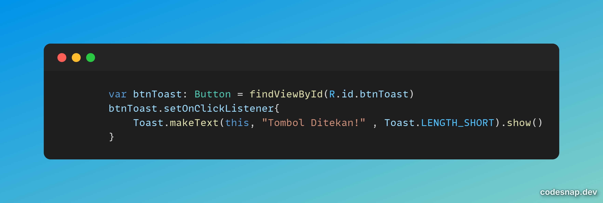
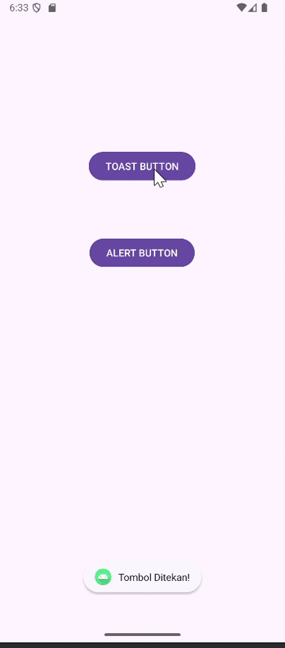

<h1 align="center">
  <a href="#"> INPUT CONTROL</a>
</h1>

<h3 align="center">Implemetasi Toast dan Alert Pada Aplikasi Mobile </h3>


## Penjelasan

```bash
Gambar 1.1
```
Logika diatas untuk input controls dengan type toast dengan id yang di targetkan  btnToast dengan output yang dihasilkan Ketika ditekan yaitu “TOMBOL DITEKAN”.

.png)
```bash
Gambar 1.2
```
Logika diatas untuk input controls dengan type alert dengan id yang ditagetkan pada button, Ketika button di klik akan muncul popup dengan title “HALO INI ALERT BOX” dan message “TUTUP DENGAN OK “. Ketika button ok ditekan popup akan hilang.

---

### Demo

